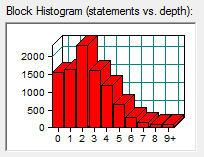
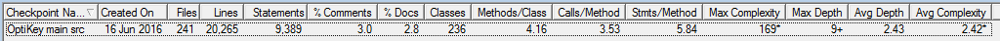
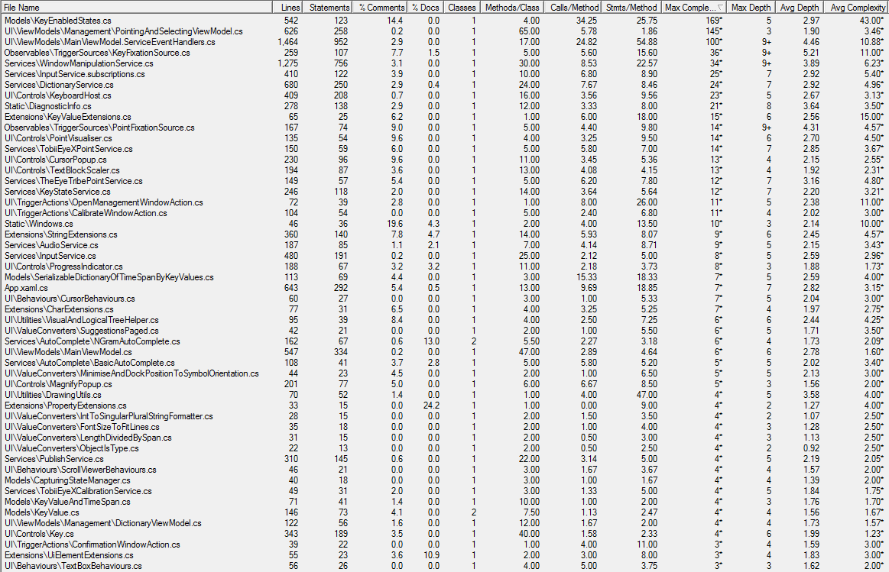
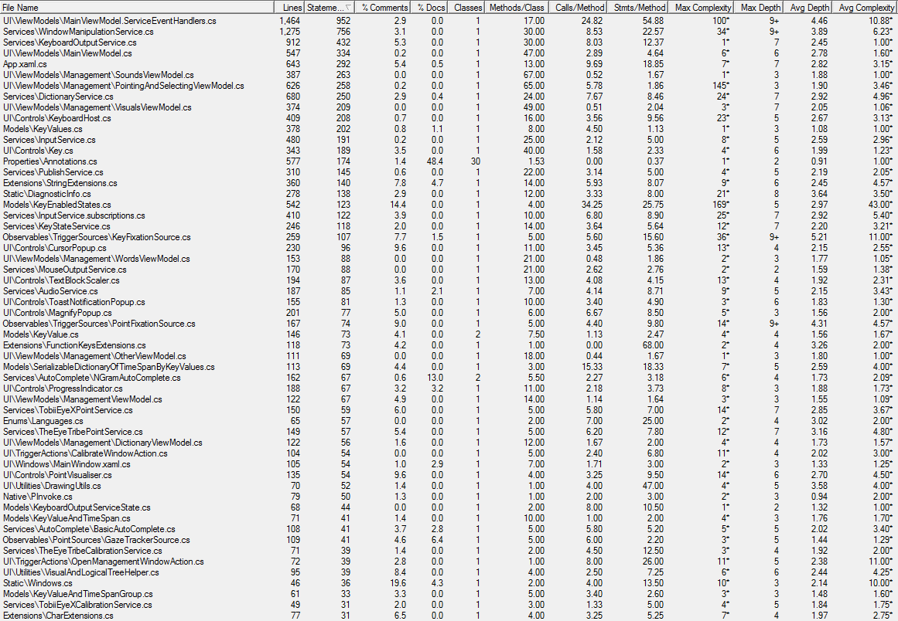

#Metrics, Variability and Quality Measures

##OptiKey - coping with the pace 
OptiKey should work on a Windows PC/laptop/tablet that is capable of running the .Net 4.6 Framework (this does not include Windows RT tablets), which should be any version of Windows from Vista SP2 up to Windows 10.
Your device should be relatively modern/capable, but high-end computer specs are not required by OptiKey.
If you are using an eye tracking device your PC/laptop/tablet will need to meet the minimum requirements of your eye tracker's software. 
These are typically more than enough for OptiKey to run flawlessly.

##OptiKey - Code analysis and evaluation metrics

## Qualities Handling and System  requirements
OptiKey is an assistive on-screen keyboard which runs on Windows only.

It is designed to be used with a low cost eye-tracking device to bring keyboard control, mouse control and speech to people with motor and speech limitations, such as people living with Amyotrophic Lateral Sclerosis (ALS) / Motor Neuron Disease (MND).

OptiKey was written to challenge the outrageously expensive, unreliable and difficult to use AAC (alternative and augmentative communication) products on the market. It is, therefore, fully open-source and free. Forever.

It works out of the box once you have your eye-tracking device installed and allows selections to be made using dwell selection, as well as physical buttons and assistive devices. If you do not have an eye tracking device you can use OptiKey with a mouse or your webcam.

OptiKey can be used as an alternative to a physical keyboard, allowing you to type into any application.

OptiKey can automatically insert spaces between words and capitalise letters for you to increase your typing rate.

 You can even type whole words and phrases in a single selection by "swiping" or using "auto-complete".

OptiKey can replace your mouse, allowing you to click, scroll and drag with precision anywhere on screen.

To communicate naturally with those around you select the 'Speak' key and OptiKey will convert what you have typed into speech.

requirements**:**

1.  computer/laptop/tablet that meets the minimum requirements of your chosen eye tracker.

2.  eye tracking devices, [guide Using eye trackers](https://github.com/JuliusSweetland/OptiKey/wiki/Using-eye-trackers)

Type your first word

1.  Run OptiKey for the first time and it will be displayed with a dark theme, position itself at the top of your screen (docked), and ensure that any other running applications are positioned in the remaining free space. By default it uses your mouse cursor position for input and selecting a key is performed by hovering over a key for about 1.5 seconds.

2.  Try it out - move your mouse cursor over OptiKey and notice how the current key under your cursor is highlighted with a red outline. Keep the mouse cursor over a single key and you'll see an indication of your selection progress on the current key. This is a method of selection called "fixation" or "dwell" and requires you to keep your attention (the cursor) on each key for an amount of time in order to select the key.

3.  Complete a selection over a letter and it will be pressed and appear in the "scratchpad" at the top. You will also notice that some auto complete suggestions will appear above the scratchpad. Keep selecting letters to type a whole word, or select one of the auto complete suggestions to complete your word.

If you make a mistake you can use the backspace key to delete your last selection:

or the BackMany key to delete the last whole word:

That's all there is to start selecting keys and typing words
check out the [video section](https://github.com/JuliusSweetland/OptiKey/wiki/Videos).
