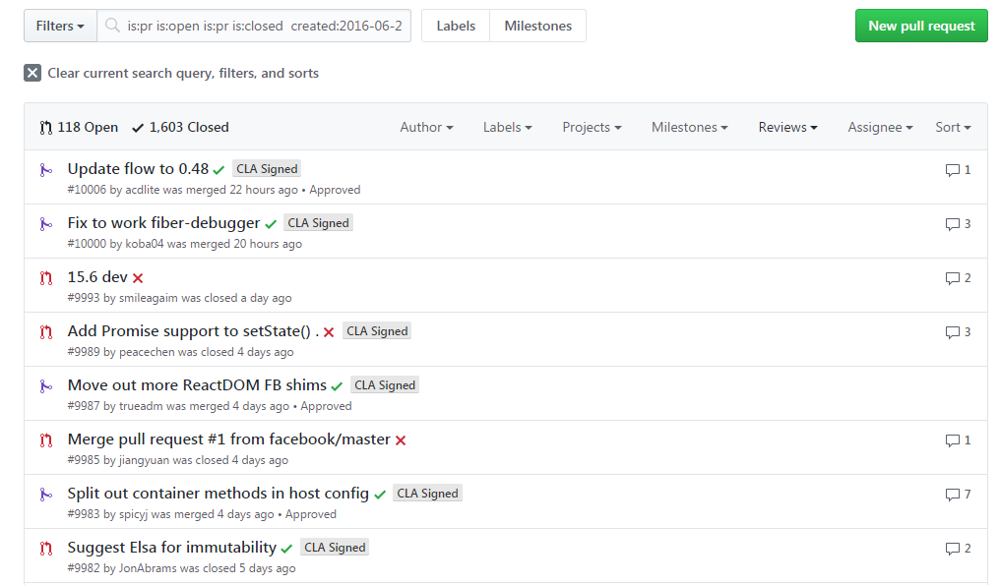
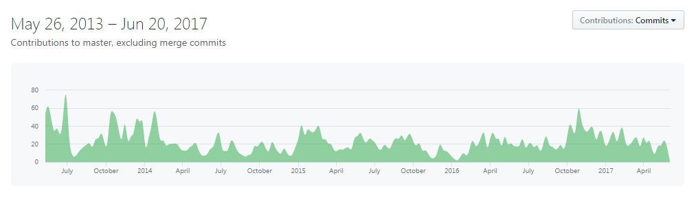
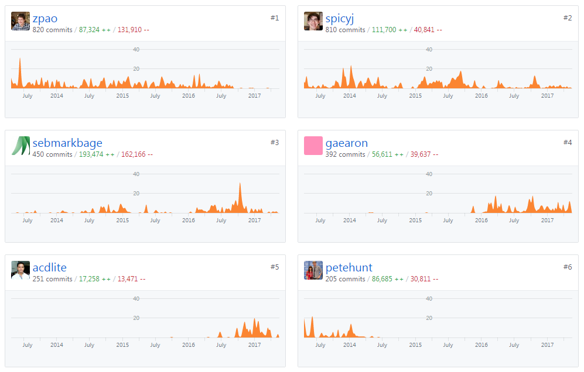

## Introduction

React is an open-source Javascript library, firstly develop by Facebook and used by a lot of very big companies (like Airbnb, Reddit,  SalesForce, Twitter, WhatsApp and of course Facebook and Instagram). React processes only user interfaces in applications. This is the View in the MVC (Model-View-Controller) template.

React was created by Jordan Wlake, a software enginner at Facebook. He was influenced by XHP, an HTML component framework for PHP. It was first deployed on Facebook's newsfeed in 2011 and later on Instagram.com in 2012.It was open-sourced at JSConf US in May 2013.

The React Homepage is hosted here (https://facebook.github.io/react/) and the repository can be find at :
https://github.com/facebook/react/

### Why it was chosen ?

This is one of the hotest JS library at this moment. Used by a lot a developers all around the world (and Ilya using it every day at work).

The community works a lot on the projet :

[More than 1000 Pull requests in the last year](https://github.com/facebook/react/pulls?utf8=%E2%9C%93&q=is%3Apr%20is%3Aopen%20is%3Apr%20is%3Aclosed%20%20created%3A2016-06-18..2017-12-12%20)

[Commits](https://github.com/facebook/react/commits/master)

[Contributors](https://github.com/facebook/react/graphs/contributors)

Start as an internal Facebook projet but now mainteant by a huge community and React is worked on full-time by Facebook's product infrastructure and Instagram's user interface engineering teams. They're often around and available for questions on :

**Stack Overflow**
https://stackoverflow.com/questions/tagged/reactjs

**Discussion forum**
https://discuss.reactjs.org/

**Reactiflux Chat**
https://discordapp.com/invite/0ZcbPKXt5bZjGY5n

**Freenode IRC**
http://irc.lc/freenode/reactjs

There is also help on [Facebook](https://www.facebook.com/react) and [Twitter](https://twitter.com/reactjs)

### React.js Documentation

https://facebook.github.io/react/docs/hello-world.html

### Issues
https://github.com/facebook/react/issues

To make easy the issue report there is a formated mail with simple questions :

*Do you want to request a *feature* or report a *bug*?*

*What is the current behavior?*

*If the current behavior is a bug, please provide the steps to reproduce and if possible a minimal demo of the problem via https://jsfiddle.net or similar (template: https://jsfiddle.net/84v837e9/).*

*What is the expected behavior?*

*Which versions of React, and which browser / OS are affected by this issue? Did this work in previous versions of React?*
