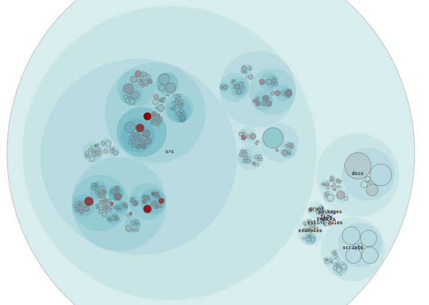
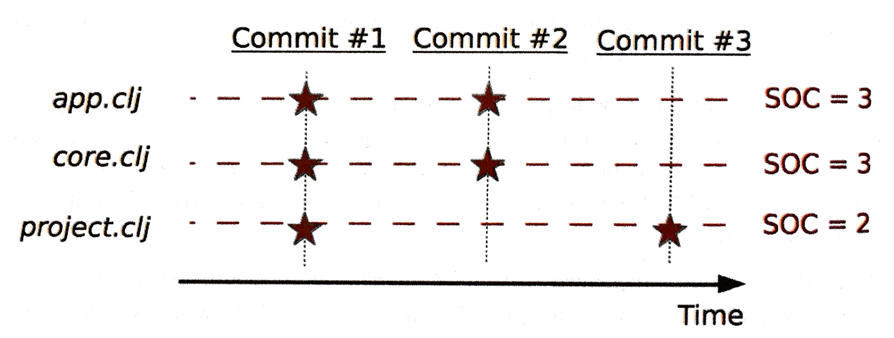
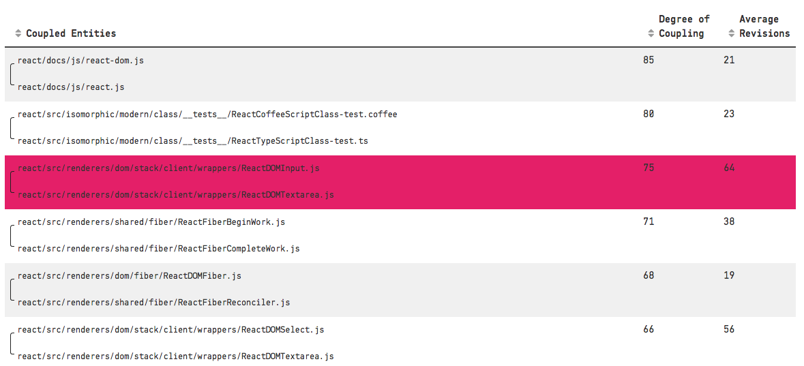
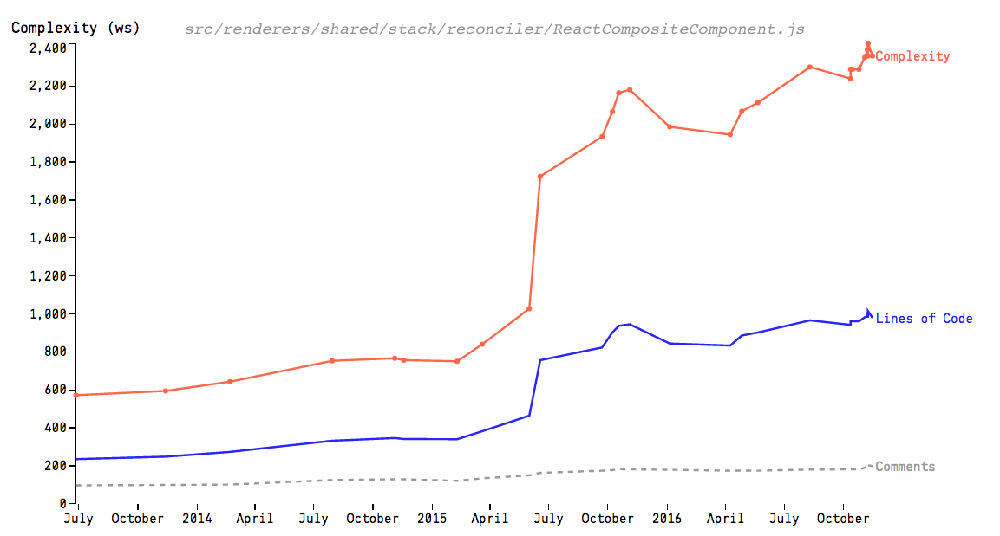
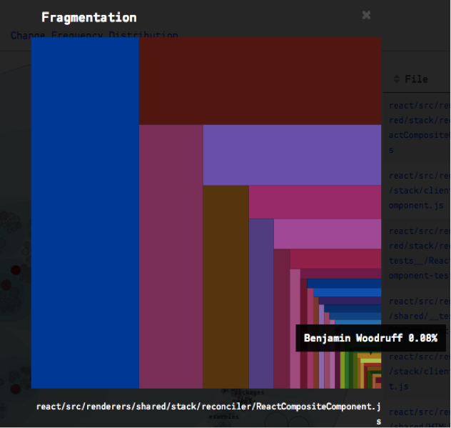
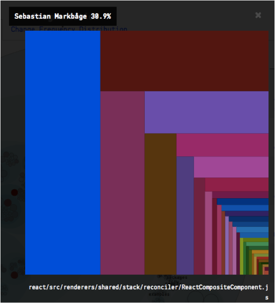

## Metrics, Variability and Quality Measures

In order to access code quality we chose to follow the chose to follow the forensic approach and metrics presented by [Adam Tornhill](http://adamtornhill.com/) in his book [Your Code as a Crime Scene](https://pragprog.com/book/atcrime/code-as-a-crime-scene). 

Following we will explain the approach, define a few of the metrics and apply them on the React code base, followed by a brief discussion. 

### The Approach

Static code analysis can only bring us so far. It only inspects a snapshot of the codebase and can surely bring results, showing the interplay of classes, finding [code smells](https://sourcemaking.com/refactoring/smells) or style deviations. The premise of the book is that code and system design changes over time, and by monitoring and analyzing exactly those changes we can discover trends previously not seen using only static analysis techniques.

### Hotspots
>If many people change a file often, it hase many reasons to change.. [violating the Single Rresponsibility Principle]
--Adam Tornhill

### Temporal Coupling

### Complexity

### Knowledge Maps and Organizational Structure

>...organizations which design systems ... are constrained to produce designs which are copies of the communication structures of these organizations
--M. Conway

