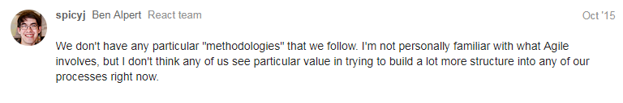

## Views and Prespectives

### Documentation and Code Structure

#### React Class Diagram

This class diagram was generated by [WAVI](https://github.com/bakunin95/wavi)

Looking at the class view of React.js , we can clearly see that the classes are well struct and divided into small ones, each class has its speciality handling its tasks without having unusual big classes. and as the single responsibility principle states, every class should have a single responsibility, and that responsibility should be entirely encapsulated by the class. All its services should be narrowly aligned with that responsibility. From what we see in this diagram , the developers of React have implement this very well that we can say the class diagram shows strong cohesion in React. Eventually this helps developers that are using the library to better understand and use it to create their own apps 

React provides the kind of composable and freely re-renderable views we need for the view layer. Close to the top of the nested view hierarchy, a special kind of view listens for events that are broadcast by the stores that it depends on. We call this a controller-view, as it provides the glue code to get the data from the stores and to pass this data down the chain of its descendants. We might have one of these controller-views governing any significant section of the page.

#### Codeline Organization 

Directory | Description
--- | --- 
docs | React Documentation & Website
eslint-rules | This is a dummy npm package that allows us to treat it as an eslint-plugin. It's not actually published, nor are the rules here useful for users of react
fixtures | Test fixtures
flow | declarations
mock | mock objects
packages | packages used in react
scripts | scripts directory
src | contains the src code of react divided itself into child directories by category and usage

### Requirements and Features (Stakeholder View)

#### Context View 

- Since React is an open source application, it is being developed on Github. this enables larger exposure to contribution and easier access to developers that want to use the library
- Main users of the React are the facebook app developers, react is a library that is created to help develop a well connected and easy operated facebook applications, so in order to create the next trending FB app, developers start their way by including the React JS 
- FB of course are the main stakeholder of React, they want to see the library widely used and growing, also when enabling developers to easily create apps on FB, this encourages the developers to create more FB connected apps and focus on the quality rather than the difficulties of connections and integrations , this comes back with great profit to facebook increasing the number of users to the social network
- being written in Java script, React has the properties of JS regarding the supported browsers , also the dependencies where it depends on npm for packaging , yarn for dependency management and JSX which is the super form of JS
- Since we are talking about an open source library, the decision to use Apache license is reasonable, this kind of license allows to freely download and use React, in whole or in part, for personal, company internal, or commercial purposes, also use React in packages or distributions that you create.

#### Development View

The development view comes to  illustrate a system from a programmers perspective and is concerned with software management. 

##### Design Patterns

##### Composition

The key feature of React is composition of components. Components written by different people should work well together. It is important to us that you can add functionality to a component without causing rippling changes throughout the codebase.

For example, it should be possible to introduce some local state into a component without changing any of the components using it. Similarly, it should be possible to add some initialization and teardown code to any component when necessary.

There is nothing "bad" about using state or lifecycle hooks in components. Like any powerful feature, they should be used in moderation, but we have no intention to remove them. On the contrary, we think they are integral parts of what makes React useful. We might enable more functional patterns in the future, but both local state and lifecycle hooks will be a part of that model.

Components are often described as "just functions" but in our view they need to be more than that to be useful. In React, components describe any composable behavior, and this includes rendering, lifecycle, and state. Some external libraries like Relay augment components with other responsibilities such as describing data dependencies. It is possible that those ideas might make it back into React too in some form.
 

### Challenges
There is a Big picture label in the issues that give some directive line to what to develop next :

**Big Picture Label** 

- [Support Passive Event Listeners](https://github.com/facebook/react/issues/6436)
- [New Core Algorithm](https://github.com/facebook/react/issues/6170)
- [Play Nicely with The DOM Event System (because it's legacy anyway)](https://github.com/facebook/react/issues/4751)
- [Umbrella: Externalize the State Tree (or alternatives)](https://github.com/facebook/react/issues/4595)
- [Include DevTools as Public API](https://github.com/facebook/react/issues/4593)

We consider that important bugs are bugs classified as difficulty: medium (there are not Hard)

**Difficulty: Medium**
- [Run some unit tests on compiled bundles](https://github.com/facebook/react/issues/9955)
- [Add More Cases to Server Rendering Fixture](https://github.com/facebook/react/issues/9866)
- [Implement Setting Unknown Attributes](https://github.com/facebook/react/issues/9477)

### React Development Process by the Team Project 
We found a very interesting discussion about React Development Process.
You can see the full discussion just here (https://discuss.reactjs.org/t/react-development-process/2135). 

Students from FEUP (Faculdade de Engenharia da Universidade do Porto), Porto, Portugal ask the React.js Team about Development Process :

"We mainly seek validation of our ideas and our interpretation of what's been going on in the development process. After careful analysis of the way the project is organised, GitHub statistics, issues and milestones list, and project wiki, we concluded that there isn't really a single, well-defined process behind the development of the React library, although it seemed clear to us, from the way development seems to focus on the evolution and improvement of the project, that several ideas were borrowed from a number of Agile methodologies.

Do you agree with this view? We look forward to feedback from the React community."

And this is the React.js Team answer !!

